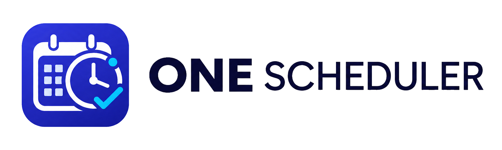
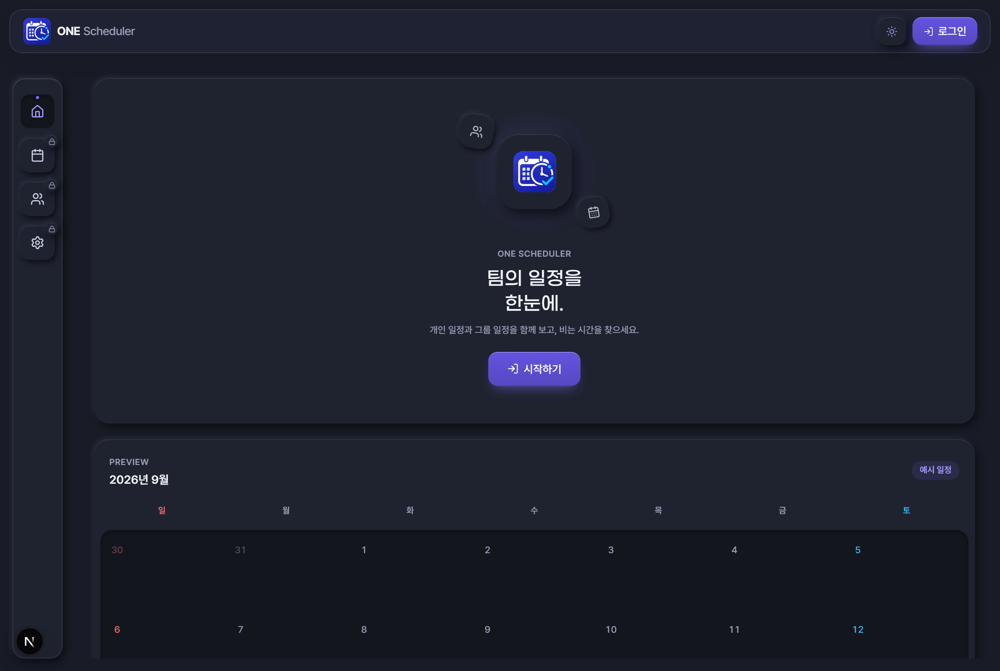
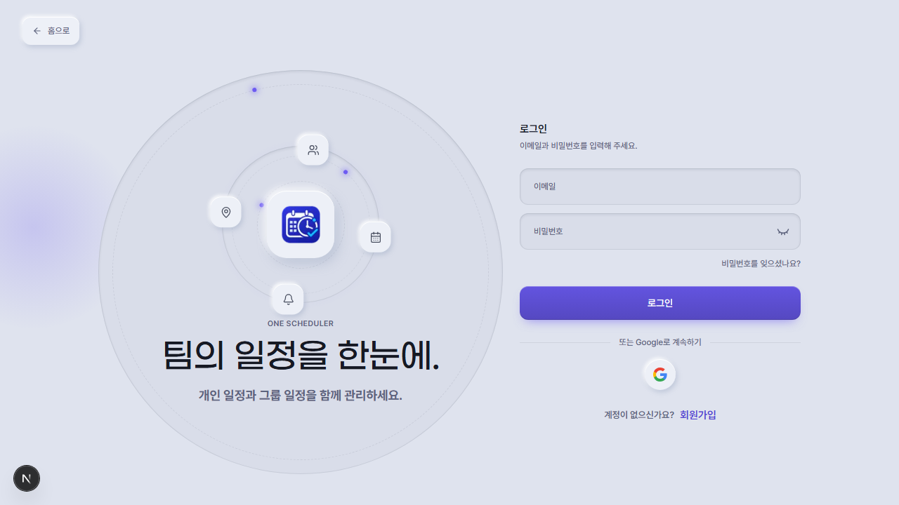
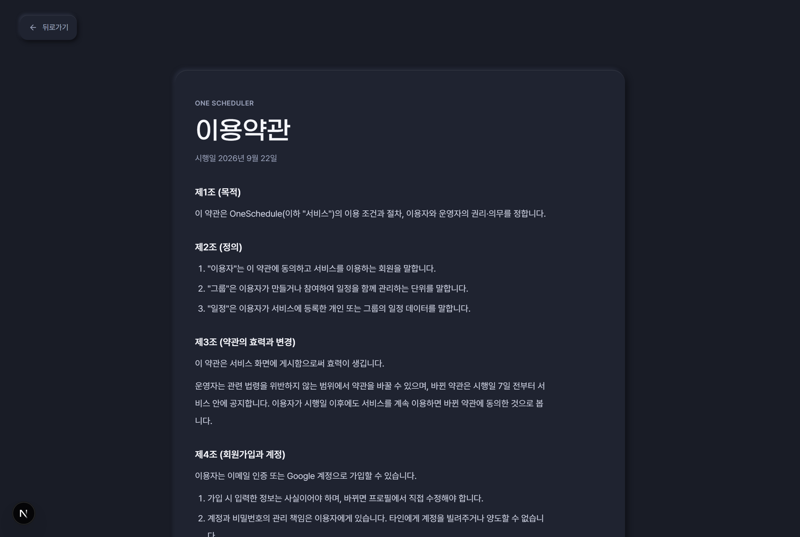
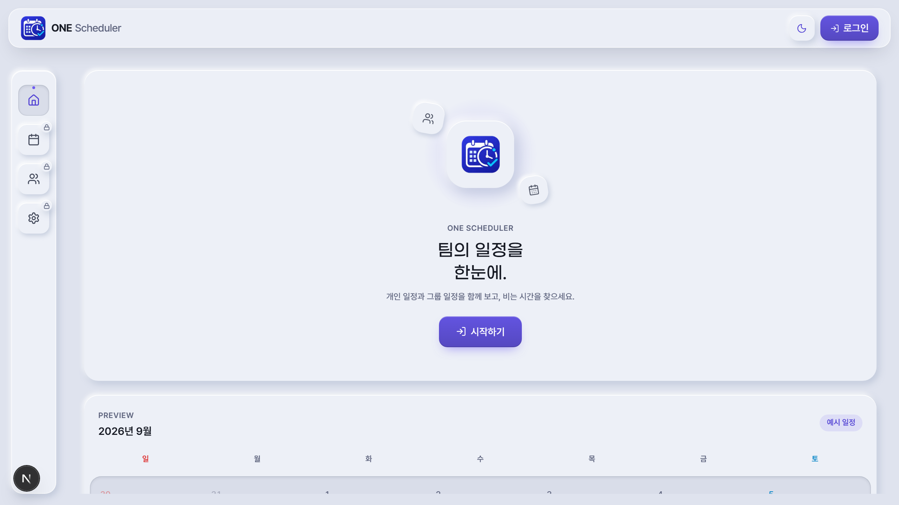
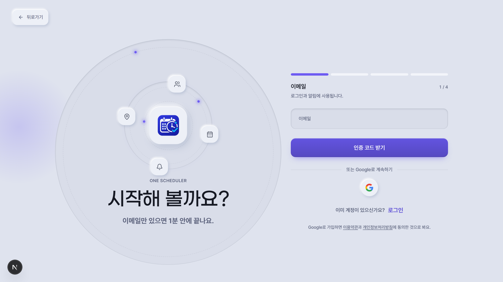
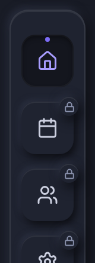
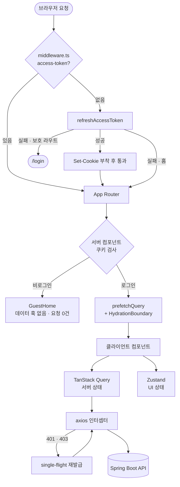

<div align="center">



# 🗓️ ONE SCHEDULE

### 개인 일정과 그룹 일정을 하나의 캘린더에서

<br />

[](https://nextjs.org/)
[](https://react.dev/)
[](https://www.typescriptlang.org/)
[](https://tanstack.com/query)
[](https://zustand-demo.pmnd.rs/)
[](https://tailwindcss.com/)

<br />

<h2>📱 Project Screenshots</h2>
<br />

<p>
  
  
</p>
<p align="center">
  <sub><i>비로그인 홈 (실제 캘린더 컴포넌트 미리보기) &nbsp; | &nbsp; 로그인</i></sub>
</p>

<br />

<p>
  
  
</p>
<p align="center">
  <sub><i>같은 토큰, 팔레트만 교체한 라이트 테마 &nbsp; | &nbsp; 이용약관 · 개인정보처리방침</i></sub>
</p>

<br />

<p>
  
  
  
</p>
<p align="center">
  <sub><i>390px 모바일 — 홈 &nbsp; | &nbsp; 회원가입 &nbsp; | &nbsp; 게스트에게 잠긴 내비</i></sub>
</p>

<br />

**[🌐 Live Demo](https://oneschedule.site)** &nbsp; **[📖 API 명세서](https://api.oneschedule.site/swagger-ui/index.html)** &nbsp; **[⚙️ Backend Repo](https://github.com/Wonyes/oneschedule-api)** &nbsp; **[📋 PRD](docs/PRD.md)**

<br />

</div>

---

## 📖 목차

- [프로젝트 소개](#-프로젝트-소개)
- [주요 기능](#-주요-기능)
- [기술 스택](#-기술-스택)
- [시스템 아키텍처](#-시스템-아키텍처)
- [기술적 도전과 해결](#-기술적-도전과-해결)
- [디자인 시스템](#-디자인-시스템)
- [테스트 & 품질](#-테스트--품질)
- [시작하기](#️-시작하기)
- [프로젝트 구조](#-프로젝트-구조)

---

## 💡 프로젝트 소개

**ONE SCHEDULE**은 **개인 일정과 그룹 일정을 하나의 캘린더에서 관리하는 통합 스케줄러**입니다.

초대 코드로 그룹에 참여하면, 내 일정과 우리 팀의 일정을 **탭 하나로 오가며** 확인하고 등록할 수 있습니다.

이 저장소는 **프론트엔드 전체**를 담당했습니다 — 기획 · 디자인 시스템 · 구현 · 테스트.
백엔드(Spring Boot)는 [oneschedule-api](https://github.com/Wonyes/oneschedule-api)에 있고, 프론트는 Vercel에 자동 배포됩니다.

<br />

### 🎯 핵심 가치

<table>
<tr>
<td width="25%" align="center">

### ⚡ 스켈레톤 없는 첫 화면

서버 컴포넌트 프리페치 +<br/>HydrationBoundary

</td>
<td width="25%" align="center">

### 🔒 비로그인 요청 0건

훅을 막는 대신<br/>서버에서 트리를 분기

</td>
<td width="25%" align="center">

### 📱 320px까지 안 무너짐

축소가 아니라 구조 변경<br/>+ e2e로 고정

</td>
<td width="25%" align="center">

### 🎨 토큰 기반 뉴모피즘

색·그림자 전부 CSS 변수<br/>테마는 팔레트만 교체

</td>
</tr>
</table>

---

## ✨ 주요 기능

### 📅 일정 · 캘린더

| **기능**                  | **설명**                                                                                     |
| :------------------------ | :------------------------------------------------------------------------------------------- |
| **🗓️ 3종 캘린더 뷰**      | 일간 / 주간 / 월간. 스와이프 · 버튼 이동을 공통 스토어로 동기화                              |
| **📐 겹침 레이아웃 엔진** | 클러스터 단위 열 배정으로 폭을 계산하고, 초과분은 `+N` 배지로 묶음                           |
| **✏️ 바텀시트 CRUD**      | 캘린더 카드 클릭 → 조회 · 수정 · 삭제, 빈 칸 클릭 → 등록                                     |
| **🔒 작성자 권한 분리**   | 등록자만 수정 · 삭제 가능하고, 다른 멤버에게는 내용만 노출                                   |
| **🔍 일정 검색**          | 헤더에서 캐시된 개인 · 그룹 일정을 제목 · 메모로 필터링, 선택 시 해당 날짜로 이동            |
| **🎛️ 다이얼 헤더**        | 제목·화살표 대신 기간 다이얼 — 옆 눈금 클릭 · 휠 · 스와이프로 이동, 일 뷰는 눈금에 날씨 표시 |
| **🔗 URL 동기화**         | `?view=&date=&type=`로 새로고침 · 공유 · 뒤로가기 복원                                       |

### 👥 그룹

| **기능**                | **설명**                                                                                    |
| :---------------------- | :------------------------------------------------------------------------------------------ |
| **🎫 초대 코드 가입**   | 코드 입력만으로 참여하는 저마찰 온보딩 흐름                                                 |
| **🔄 다중 그룹 전환**   | 활성 그룹을 쿠키로 유지하고, 무효 그룹은 자동 폴백                                          |
| **👑 그룹장 위임**      | 그룹장만 넘길 수 있고, 넘기는 즉시 본인은 관리자로 내려가 그룹장이 항상 한 명               |
| **🧑‍💼 멤버 · 직책 관리** | 그룹원 목록, 직책 수정, 그룹 해체 후 선택 화면 복귀                                         |
| **📊 그룹 대시보드**    | 멤버 현황, 일정 타임라인, 가입 신청, 최근 활동 섹션                                         |
| **🔔 알림 13종**        | 가입 · 승인 · 권한 · 일정 생성/변경/삭제 · 참여자 추가/제외 · 1시간 전 리마인더, SSE 실시간 |

### 🔐 인증 · 공통

| **기능**                                | **설명**                                                                                                                       |
| :-------------------------------------- | :----------------------------------------------------------------------------------------------------------------------------- |
| **✉️ 이메일 인증 가입 · 비밀번호 찾기** | 6자리 코드(3분 유효 · 60초 재전송 · 5회 실패 시 잠금), 같은 인증 API를 purpose로 재사용. 가입이 끝나면 바로 로그인 상태가 된다 |
| **🍪 HttpOnly 쿠키 인증**               | 토큰을 JS에서 접근하지 않고 미들웨어 · 인터셉터 이중 가드                                                                      |
| **♻️ 자동 토큰 재발급**                 | 미들웨어는 리다이렉트 전에, 인터셉터는 single-flight로                                                                         |
| **🌗 서버 렌더 테마**                   | 쿠키를 서버에서 읽어 첫 HTML부터 올바른 테마 (FOUC 없음)                                                                       |
| **🌦️ 위치 기반 날씨 · 공휴일**          | 좌표 → 주소 변환은 서버 라우트 핸들러로 프록시해 키 노출 방지                                                                  |
| **🎯 온보딩 체크리스트**                | 첫 일정 · 그룹 참여 · 프로필 3단계, 완료 시 자동 숨김                                                                          |
| **🪐 홈 대시보드**                      | 이번 주 스트립(날씨 · 일정 점), 그룹 오빗, 미니 달력, 최근 알림, 시각 따라 해 · 달이 움직이는 지평선 푸터                      |
| **🚨 에러 바운더리**                    | `error.tsx` 재시도 버튼, `not-found.tsx`, 전역 토스트                                                                          |
| **👋 회원 탈퇴**                        | 개인 일정은 삭제, 그룹 일정은 남기고 작성자 표시만 제거. 무슨 일이 일어나는지 모달에 명시                                      |

---

## 🛠 기술 스택

| **기술**                                                                                                                  | **선택 이유**                                                                                                           | **버전**  |
| :------------------------------------------------------------------------------------------------------------------------ | :---------------------------------------------------------------------------------------------------------------------- | :-------: |
|                 | 인증 쿠키를 미들웨어에서 먼저 검사하고, 로그인 여부에 따라 **서버에서 트리를 분기**하기 위해 App Router를 선택했습니다. | `16.3.4`  |
|                         | 서버 컴포넌트와 클라이언트 컴포넌트를 명시적으로 나눠 데이터 경계를 관리합니다.                                         | `19.2.4`  |
|          | `strict` · `noImplicitAny`로 API 응답 타입 불일치를 컴파일 단계에서 잡습니다.                                           |  `5.9.3`  |
|  | 서버 상태를 위임하고, 서버에서 `prefetchQuery` → `HydrationBoundary`로 넘겨 초기 로딩을 제거합니다.                     | `5.101.2` |
|                                                | 뷰 모드 · 선택 날짜 · 시트 · 토스트처럼 **URL에 담을 필요 없는 UI 상태**만 담당해 Context 중첩을 피합니다.              | `5.0.14`  |
|                         | 401/403 → 재발급 → 원요청 재시도 흐름을 인터셉터 한 곳에서 처리합니다.                                                  | `1.18.1`  |
|         | 뉴모피즘은 테마마다 그림자 값이 완전히 달라, 색 · 그림자를 CSS 변수로 정의하고 시맨틱 토큰만 쓰도록 강제했습니다.       |  `4.3.1`  |
|                            | 겹침 계산 · 토큰 재발급 등 **순수 로직**의 회귀 방지                                                                    | `30.4.2`  |
|          | 모바일 오버플로 · 비로그인 네트워크처럼 **실제 브라우저가 필요한** 검증                                                 | `1.61.1`  |
|                      | `main` 푸시 시 자동 배포                                                                                                |     —     |

---

## 🏗 시스템 아키텍처

### 요청이 화면에 도달하기까지



### 상태 관리 경계

| **구분**               | **담당**       | **예시**                                                |
| :--------------------- | :------------- | :------------------------------------------------------ |
| 서버 상태              | TanStack Query | 일정 목록, 그룹 정보, 내 정보, 날씨 · 공휴일            |
| 클라이언트 UI 상태     | Zustand        | 캘린더 뷰 모드 · 선택 날짜, 바텀시트, 오버레이 · 토스트 |
| 서버 · 클라이언트 공유 | **쿠키**       | 인증 토큰, 테마, 활성 그룹 (§4️⃣ 참조)                   |

---

## 🔧 기술적 도전과 해결

### 1️⃣ 비로그인 사용자의 API 호출을 "0건"으로 만들기 (401/403 무한 루프 해결)

<details open>
<summary><b>enabled 옵션이 아니라, 서버에서 컴포넌트 트리 자체를 분기시킨 이유</b></summary>
<br />

**문제 상황**

비로그인 상태로 홈에 진입하면 콘솔이 `401`, `403`으로 도배됐습니다. 더 심각한 건 **무한 루프**였습니다.
axios 인터셉터가 401을 감지 → 토큰 재발급 시도 → 재발급도 실패 → 컴포넌트 리렌더 → 다시 호출.

**원인 분석**

처음에는 `useQuery`의 `enabled` 옵션으로 막으려 했습니다. 하지만 데이터 훅이 늘어날 때마다 조건을 빠뜨렸고, 훅마다 판정 기준이 제각각이 됐습니다.
근본 원인은 명확했습니다. **훅이 마운트되는 순간 요청은 이미 나갑니다.** early return보다 훅 실행이 먼저이기 때문에, 화면에 보이지 않는 컴포넌트조차 요청을 흘립니다.

**해결 방안: 호출을 막는 게 아니라 마운트를 막는다**

App Router의 서버 컴포넌트에서 쿠키를 읽어, **데이터 훅이 든 트리를 아예 렌더하지 않도록** 분기했습니다.

```tsx
// src/app/(main)/page.tsx
export default async function HomePage() {
  const cookieStore = await cookies();

  // 액세스 토큰이 없으면 데이터 훅이 든 트리를 렌더 자체를 하지 않는다
  if (!cookieStore.get("access-token")) return <GuestHome />;

  const queryClient = getServerQueryClient();

  // 로그인 사용자는 서버에서 미리 받아 클라이언트로 넘긴다
  const [user] = await Promise.all([
    getMyInfo(),
    queryClient.prefetchQuery({
      queryKey: [scheduleKeys.list, "PERSONAL"] /* ... */,
    }),
    queryClient.prefetchQuery({ queryKey: [groupkeys.myGroup] /* ... */ }),
  ]);

  if (!user) return <GuestHome />;

  return (
    <HydrationBoundary state={dehydrate(queryClient)}>
      <HomeContent
        user={user}
        initialGroups={groups}
        activeGroup={activeGroup}
      />
    </HydrationBoundary>
  );
}
```

**결과**

- 비로그인 사용자의 백엔드 요청 **0건** — 콘솔 에러와 재발급 루프가 함께 사라졌습니다.
- 로그인 사용자는 서버 프리페치 + `HydrationBoundary` 덕분에 **첫 화면에서 로딩 스켈레톤을 보지 않습니다.**
- 이 동작을 e2e로 고정해, 새 훅을 추가하다 다시 깨지면 CI에서 잡히도록 만들었습니다.

```ts
// tests/e2e/guest-network.spec.ts — /, /login, /sign 세 라우트 모두 검증
page.on("request", (req) => {
  if (req.url().includes("/v1/api")) calls.push(req.url());
});
expect(calls).toHaveLength(0);
```

</details>

### 2️⃣ 미들웨어와 인터셉터의 토큰 재발급 순서 제어

<details open>
<summary><b>리프레시 토큰이 살아있는데도 로그아웃되던 문제와, 재발급 요청 중복 발사 차단</b></summary>
<br />

**문제 상황**

재방문하면 자동 로그인이 되어야 하는데 매번 `/login`으로 튕겼습니다.

**원인 분석**

미들웨어가 **액세스 토큰 쿠키가 없다는 이유만으로** 즉시 리다이렉트하고 있었습니다.
액세스 토큰은 수명이 짧아 만료되는 것이 정상이고, 이때 리프레시 토큰으로 재발급받으면 되는 상황인데 **미들웨어가 그 기회를 먼저 잘라낸** 것입니다.

**해결 방안 1: 리다이렉트보다 재발급을 먼저**

리다이렉트 전에 재발급을 시도하고, 성공하면 백엔드가 내려준 `Set-Cookie`를 응답에 그대로 얹어 통과시킵니다.

```ts
// src/middleware.ts
if ((isPrivateRoute || isHome) && !accessToken) {
  const refreshed = await tryRefreshToken(request);

  // 재발급 성공 → 새 쿠키를 응답 헤더에 붙여서 그대로 진행
  if (refreshed) return applyRefreshedCookies(NextResponse.next(), refreshed);

  // 홈은 재발급이 실패해도 통과 (비로그인 소개 화면을 보여줘야 하므로)
  if (isHome) return NextResponse.next();

  return NextResponse.redirect(new URL("/login", request.url));
}
```

**해결 방안 2: single-flight로 재발급 중복 차단**

브라우저에서도 401이 동시에 여러 개 터지면 재발급 요청이 그 수만큼 발사됐습니다. 진행 중인 Promise를 공유하도록 묶었습니다.

```ts
// src/lib/api.ts — 동시에 몇 개가 401을 받든 재발급은 1회
if (!refreshPromise) {
  refreshPromise = api
    .post("/token-refresh")
    .then(() => undefined)
    .finally(() => {
      refreshPromise = null;
    });
}
await refreshPromise;
return api(originalRequest); // 원요청 재시도
```

**결과**

- 재방문 시 **자동 로그인 복구** — 만료된 액세스 토큰은 사용자가 인지하지 못한 채 갱신됩니다.
- 동시 요청 N개 → 재발급 요청 **1회**. 로그인 · 재발급 엔드포인트 자신은 `_skipAuthRefresh`로 제외하고, `_retry` 플래그로 재시도는 1회로 제한해 순환을 차단했습니다.
- 인터셉터의 재발급 흐름을 `axios-mock-adapter`로 단위 테스트해 회귀를 막았습니다.

</details>

### 3️⃣ 겹치는 일정의 폭 계산 알고리즘 재작성

<details open>
<summary><b>체인형 겹침에서 카드가 서로를 침범하던 문제 — 클러스터 단위 열 배정으로 전환</b></summary>
<br />

**문제 상황**

같은 시간대에 일정이 2개 이상이면 카드가 겹쳐 찍히고, 3개를 넘어가면 폭이 0에 수렴해 제목조차 보이지 않았습니다.

**원인 분석**

초기 구현은 **"나와 겹치는 일정의 수"로 폭을 나누는 방식**이었습니다.
A-B가 겹치고 B-C가 겹치지만 A-C는 겹치지 않는 **체인형 겹침**에서, A와 C가 서로 다른 기준으로 폭을 계산해 결국 서로를 침범합니다.

**해결 방안: 폭의 단위를 개별 일정 → 연결된 덩어리(클러스터)로**

계산을 3단계로 재작성했습니다.

```ts
// src/utils/schedule.ts

// ① 클러스터링 — 직전까지의 최대 종료 시각과 안 겹치면 새 묶음으로 분리
sorted.forEach((event) => {
  if (current.length > 0 && event.top >= clusterEnd) {
    clusters.push(current);
    current = [];
    clusterEnd = -Infinity;
  }
  current.push(event);
  clusterEnd = Math.max(clusterEnd, event.top + event.height);
});

// ② 열 배정 — 마지막 일정과 안 겹치는 기존 열이 있으면 재사용
cluster.forEach((event) => {
  const column = columns.find(
    (col) => !isOverlapping(col[col.length - 1], event),
  );
  column ? column.push(event) : columns.push([event]);
});

// ③ 폭 분할 — 개별 일정이 아니라 "클러스터의 열 개수"로 나눈다
const width = 100 / columns.length;
```

**추가 문제: 열이 늘어나면 어떤 비율로 나눠도 못 읽는다**

뷰마다 표시 가능한 최대 열 수를 다르게 두고(주간 2, 일간 4), 넘치는 일정은 **클러스터 전체 높이를 차지하는 `+N` 오버플로 배지**로 묶어 클릭 시 목록을 띄우도록 했습니다.

**결과**

- 체인형 겹침 · 완전 포함 · 부분 겹침 전 케이스에서 카드 침범이 사라졌습니다.
- 좁은 화면에서도 최소 가독 폭이 보장됩니다.
- 겹침 레이아웃과 `markConflicts`를 **단위 테스트로 고정**해 뷰를 손볼 때마다 다시 깨지지 않게 했습니다.

</details>

### 4️⃣ 서버와 클라이언트가 같은 값을 읽어야 할 때의 저장소 설계

<details open>
<summary><b>localStorage로 시작했다가 하이드레이션이 깨진 이유, 그리고 쿠키로 옮긴 근거</b></summary>
<br />

**문제 상황**

백엔드 스키마를 유저-그룹 1:1(`groupCode`)에서 N:M으로 바꾸면서, 프론트에도 **"지금 보고 있는 그룹"** 이라는 상태가 필요해졌습니다.
가장 먼저 떠오른 건 `localStorage`였습니다.

**원인 분석**

홈은 서버 컴포넌트가 그룹 데이터를 먼저 그립니다. 그런데 **서버는 localStorage를 읽을 수 없습니다.**
서버는 "그룹 A", 클라이언트는 "그룹 B"를 그리게 되고 → **하이드레이션 미스매치**가 발생합니다.

테마 전환도 정확히 같은 문제였습니다. 클라이언트에서 `data-theme` 속성만 바꾸면 `router.refresh()` 시 서버 렌더 결과에 덮여 사라집니다.

**해결 방안: 서버가 먼저 그리는 값의 저장소는 쿠키**

```tsx
// src/app/layout.tsx — 테마를 서버에서 읽어 <html>에 심는다
const themeCookie = (await cookies()).get("theme")?.value;
const theme =
  themeCookie === "dark" || themeCookie === "light" ? themeCookie : undefined;

return (
  <html lang="ko" data-theme={theme}>
    {" "}
    ...{" "}
  </html>
);
```

활성 그룹 번호도 쿠키에 담되, **탈퇴 · 해체로 언제든 무효가 될 수 있으므로** 항상 실제 목록과 대조해 폴백합니다.

```ts
// src/lib/activeGroup.ts
export function resolveActiveGroup(
  groups: MyGroupResponse[],
  activeGroupNo: number | null,
) {
  if (groups.length === 0) return undefined;
  // 저장된 번호가 더 이상 없는 그룹을 가리키면 첫 번째 그룹으로
  return groups.find((g) => g.groupNo === activeGroupNo) ?? groups[0];
}
```

**결과**

- 하이드레이션 미스매치 해소 + **테마 깜빡임(FOUC) 없음** — 서버가 첫 HTML부터 올바른 테마로 그립니다.
- 그룹을 해체해도 빈 화면 대신 남은 그룹으로 자연스럽게 전환됩니다.
- **트레이드오프 인지**: 루트에서 쿠키를 읽는 순간 모든 라우트가 동적 렌더링이 됩니다. 현재 규모에서는 깜빡임 없는 테마가 더 가치 있다고 판단했고, 트래픽이 커지면 PPR 도입을 검토할 지점으로 기록해 두었습니다.

</details>

### 5️⃣ 모바일 캘린더 — 축소가 아니라 구조 변경

<details open>
<summary><b>320px에서 날짜와 날씨가 겹치던 문제, 그리고 눈으로 하는 QA를 테스트로 대체한 과정</b></summary>
<br />

**문제 상황**

320~390px 구간에서 월간 뷰는 **날짜 숫자와 날씨 아이콘이 겹치고**, 주간 뷰는 요일 텍스트가 칸을 넘쳤습니다. 일정 카드까지 얹히면 아무것도 읽을 수 없었습니다.

**원인 분석**

데스크톱 그리드를 그대로 축소했기 때문입니다. **그리드는 폭이 줄면 정보 밀도를 유지할 수 없습니다.** 반응형 값을 조정하는 것으로는 해결되지 않는 종류의 문제였습니다.

**해결 방안: 모바일에서는 레이아웃 구조 자체를 교체**

| 뷰   | 데스크톱                     | 모바일                                                                           |
| :--- | :--------------------------- | :------------------------------------------------------------------------------- |
| 월간 | 칸 안에 일정 카드 렌더       | **날짜 + 일정 유무 닷**만 남기고, 선택 날짜의 일정은 **하단 아젠다 패널**로 분리 |
| 주간 | 요일 + 날씨 + 온도 전체 표기 | 헤더 정렬 재구성, 날씨는 배지로 축약                                             |
| 헤더 | 스케줄 탭 + 뷰 전환          | 스케줄 탭 숨김, 뷰 전환만 유지                                                   |

**결과 + 회귀 방지**

고쳐 놓아도 다른 작업 중에 계속 다시 깨졌습니다. 눈으로 확인하는 QA는 반드시 놓치기 때문에, **가로 오버플로가 생기면 실패하는 테스트**를 붙였습니다.

```ts
// tests/e2e/mobile-layout.spec.ts — WIDTHS = [320, 390]
const overflow = await page.evaluate(() => {
  const doc = document.documentElement;
  return { scrollWidth: doc.scrollWidth, clientWidth: doc.clientWidth };
});

// 1px 반올림 오차만 허용
expect(overflow.scrollWidth).toBeLessThanOrEqual(overflow.clientWidth + 1);
```

이 테스트를 붙인 뒤로 모바일 오버플로는 재발하지 않았습니다.

</details>

### 6️⃣ 디자인 스킬의 지적을 "지표"로 바꾸기 — 대비 · 터치 타깃 · 트랩

<details open>
<summary><b>눈으로는 멀쩡해 보이던 화면에서 측정으로만 드러난 것들</b></summary>
<br />

**문제 상황**

화면은 잘 나오는데, 실제로 재보면 기준을 못 넘는 값들이 있었습니다. 감으로 고치면 또 다른 곳이 어긋나서, **브라우저에서 실측한 숫자**를 기준으로 삼았습니다.

**측정 결과와 조치**

| 항목                      |  이전  |    이후     | 조치                                                                               |
| :------------------------ | :----: | :---------: | :--------------------------------------------------------------------------------- |
| 기본 버튼 흰 글자 대비    | 3.26:1 | **5.42:1**  | 그라데이션 상단이 밝아 기준 미달 → 글자를 얹는 면 전용 `--accent-strong` 토큰 분리 |
| 액센트 글자 대비 (다크)   | 3.94:1 | **6.66:1**  | 배경용 `--accent`와 글자용 `--accent-text`를 분리                                  |
| 카테고리 칩 글자 (라이트) | 2.1:1  | **4.79:1↑** | hex 하드코딩을 `--cat-*` / `--cat-*-text` 토큰으로, 글자색만 테마별 분기           |
| 최소 캡션 크기            |  10px  |  **11px**   | `typo-caption-3` 상향                                                              |
| 이메일 입력 탭 영역       |  32px  |  **48px**   | 입력이 상자를 꽉 채우도록 (라벨 위치는 `pt-4`와 상쇄돼 그대로)                     |

**함정 클릭 제거**

게스트가 홈의 달력이나 사이드바를 누르면 **아무 예고 없이 `/login`으로 튕겼습니다.** 콘텐츠처럼 보이는 것이 사실은 위장된 CTA였던 셈입니다.
이동을 없애고, 사이드바 항목에는 자물쇠 배지를, 클릭에는 안내 토스트를 붙였습니다.

```tsx
// src/components/home/guest/GuestPreview.tsx
// 눌러도 페이지를 옮기지 않고 안내만 띄운다 — 구경하던 사람을 예고 없이 로그인 폼으로 보내지 않기 위해
const hint = () =>
  openToast({ message: "로그인하면 일정을 직접 추가할 수 있어요." });
```

**그리고 브라우저가 그리는 것들**

디자인 시스템이 손대지 않으면 브라우저 기본값으로 남는 표면들 — 선택 영역, 캐럿, 네이티브 컨트롤 — 도 팔레트에서 가져오도록 했습니다.

```css
::selection {
  background: color-mix(in srgb, var(--accent) 32%, transparent);
}
input,
textarea {
  caret-color: var(--accent);
}
:where(input[type="checkbox"], input[type="radio"], progress) {
  accent-color: var(--accent);
}
```

**결과**

- 4개 공개 라우트 × 데스크톱/모바일 전부에서 **앱 콘솔 에러 0건 · 가로 오버플로 0건**.
- 접근성 수치는 감이 아니라 **재현 가능한 측정값**으로 관리됩니다.
- 타이포 유틸리티는 실사용 횟수를 세어 **15개 → 12개**로 줄였습니다. (미사용 2개 삭제, 같은 역할의 `typo-h3`를 `typo-h4`로 통합)

</details>

---

## 🎨 디자인 시스템

표면 처리 규칙이 없으면 컴포넌트를 아무리 다듬어도 화면 전체가 따로 놉니다. 규칙을 **셋**으로 줄이고, 색은 전부 `globals.css`의 CSS 변수로만 정의했습니다.

| **유틸리티**  | **용도**                                | **형태**                      |
| :------------ | :-------------------------------------- | :---------------------------- |
| `neu-flat`    | 카드, 리스트 행 등 대부분의 콘텐츠 면   | 솟아오름 `--elevation-1`      |
| `neu-float`   | 브랜드 히어로 등 더 떠 있어야 하는 요소 | 크게 솟아오름 `--elevation-2` |
| `neu-pressed` | 입력창, 캘린더 그리드, 토글 트랙        | 파임 `--inset-1`              |

시행착오에서 확정한 원칙입니다.

- 🔦 **솟은 면은 상단 1px 베벨 + 우하단 그림자가 세트입니다.** 베벨이 없으면 같은 그림자여도 사람 눈에는 **구멍**으로 읽힙니다. 초기 뉴모피즘이 촌스러웠던 진짜 원인이었습니다.
- 🪜 **표면색은 배경보다 항상 한 단계 밝아야 합니다.** 같거나 어두우면 어떤 그림자를 얹어도 파여 보입니다.
- 🌫️ **그림자는 불투명 회색이 아니라 반투명(rgba)으로.** 불투명이면 요소가 인접할 때 경계가 띠처럼 보입니다.
- 🚫 **컴포넌트에 `text-white` 같은 고정 색을 쓰지 않습니다.** 테마를 바꾸면 배경만 바뀌고 글자는 그대로 남아 안 보이게 됩니다. (예외: 브랜드 색 뱃지처럼 배경이 테마와 무관하게 고정인 요소)
- 🩹 **백드롭 필터는 쓰지 않았습니다.** 스크롤 성능 부담이 커서 뉴모피즘 방향으로 고정했습니다.

---

## 🧪 테스트 & 품질

```
Test Suites: 20 passed, 20 total
Tests:      159 passed, 159 total
```

| **도구**       | **커버 대상**                                                                                                                                                        |
| :------------- | :------------------------------------------------------------------------------------------------------------------------------------------------------------------- |
| **Jest**       | 일정 겹침 레이아웃, `markConflicts`, axios 인터셉터 재발급 흐름, 활성 그룹 폴백, 폼 훅, 시트의 개인/그룹 판정, 뮤테이션 파라미터 전달                                |
| **컴포넌트**   | 가입 동의(전체/개별 토글), 종일 줄(다일 막대가 걸친 날짜 수만큼 이어지는지), 이메일 인증 스텝(쿨다운 · 만료 · 완료), 시트 폼(제목 글자수 · 읽기전용 · 카테고리 선택) |
| **Playwright** | 로그인, 회원가입 후 온보딩, **비로그인 네트워크 0건**, **320 / 390px 가로 오버플로**                                                                                 |
| **TypeScript** | `strict`, `noImplicitAny`. `npm run build`는 `tsc --noEmit`을 먼저 통과해야 진행                                                                                     |

> 테스트는 대부분 **실제로 터진 버그를 고친 뒤 회귀 방지용으로** 추가했습니다.
> 커버리지 숫자보다 **같은 버그가 두 번 나지 않는 것**을 기준으로 삼았습니다.

---

## ⚙️ 시작하기

Node.js 20+ 와 실행 중인 백엔드 API 서버가 필요합니다.

```bash
npm install
npm run dev
```

**`.env.local`**

| **변수**                     | **설명**                                                               |
| :--------------------------- | :--------------------------------------------------------------------- |
| `NEXT_PUBLIC_WEB_IP`         | 프론트 자체 오리진. Playwright e2e의 `baseURL`                         |
| `NEXT_PUBLIC_SERVER_IP`      | 백엔드 API 오리진. 브라우저와 서버 컴포넌트 양쪽에서 호출              |
| `KAKAO_REST_API_KEY`         | 좌표→주소 변환용. **서버에서만 사용**하므로 `NEXT_PUBLIC_` 접두사 없음 |
| `E2E_EMAIL` / `E2E_PASSWORD` | Playwright 로그인 테스트 계정. 없으면 해당 테스트는 자동 skip          |

**스크립트**

| **명령**           | **설명**                                  |
| :----------------- | :---------------------------------------- |
| `npm run dev`      | 개발 서버                                 |
| `npm run build`    | `tsc --noEmit` 타입 체크 후 프로덕션 빌드 |
| `npm run test`     | Jest 단위 테스트                          |
| `npm run coverage` | 커버리지 리포트                           |
| `npm run e2e`      | Playwright e2e                            |
| `npm run lint`     | ESLint                                    |

---

## 📁 프로젝트 구조

📦`src`

| **폴더**         | **설명**                                                                                                                                      |
| :--------------- | :-------------------------------------------------------------------------------------------------------------------------------------------- |
| 📂`app`          | App Router 페이지 · 레이아웃 · 라우트 핸들러 (`/api/address` 카카오 좌표→주소 프록시)                                                         |
| 📂`components`   | `common`(헤더 · 사이드바) · `home` · `group` · `schedule` · `ui`(카드 · 시트 · 오버레이)                                                      |
| 📂`hooks/querys` | TanStack Query 훅과 쿼리 키. 서버 상태 접근은 전부 이 레이어를 통과. 큰 도메인은 조회(`useGroupQueries`)와 변경(`useGroupMutations`)으로 나눔 |
| 📂`hooks/stores` | Zustand 스토어 — 캘린더 · 시트 · 오버레이 · 활성 그룹                                                                                         |
| 📂`lib`          | axios 인스턴스와 인터셉터, 서버 전용 fetch, 토큰 재발급, 활성 그룹 유틸                                                                       |
| 📂`types`        | API 요청 · 응답 인터페이스                                                                                                                    |
| 📂`utils`        | 순수 함수 — `schedule`(변환 · 날짜) · `lanes`(겹침 · 레인 배치) · `weather` · `calendar`. 호출부가 많아 `schedule`이 배럴 역할을 겸함         |
| 📂`tests/e2e`    | Playwright — 로그인 · 온보딩 · 비로그인 네트워크 · 모바일 오버플로                                                                            |

---

## 🙏 참고 · 감사

- [Next.js](https://nextjs.org/) · [TanStack Query](https://tanstack.com/query) · [Zustand](https://zustand-demo.pmnd.rs/) — 서버/클라이언트 상태 경계
- [Tailwind CSS v4](https://tailwindcss.com/) — `@theme` · `@utility` 기반 토큰 시스템
- [Motion](https://motion.dev/) · [Lucide](https://lucide.dev/) — 모션과 아이콘
- [공공데이터포털](https://www.data.go.kr/) — 기상청 단기예보 · 특일(공휴일) 정보
- [Vercel](https://vercel.com/) — 배포

---

<div align="center">

### 💬 문의하기

프로젝트에 대한 질문이나 제안이 있으시면
[Issue](../../issues) 또는 dnjsl216@naver.com으로 연락해 주세요.

<br />

**ONE SCHEDULE** · [oneschedule.site](https://oneschedule.site)

<br />

⭐ 도움이 되셨다면 Star를 눌러주세요!

</div>
